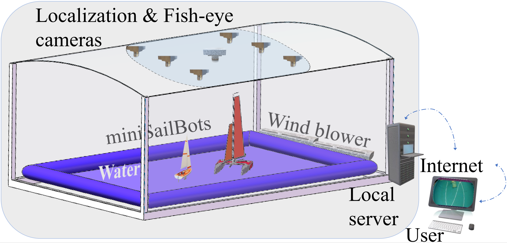

# ARS-WebControl
Sailboat Test Arena ([STAr](http://sailboat.oicp.io/STAr/)) is a research project related to teleoperation and automation of sailboats, conducted by State Joint Engineering Lab on Robotics and Intelligent Manufacturing, The Chinese University of Hong Kong, Shenzhen. This repository contains its web server, serial server, and some data.

## STAr Architecture

### Overview

### Physical Environment

##### miniSailBots

##### Camera

##### Wind field

### Webserver

## Repo. Catalogue
* [STAr](https://github.com/BrandoZhang/STAr/tree/master/STAr) :         main workshop directory.
* [develop](https://github.com/BrandoZhang/STAr/tree/master/develop) :      test&develop directory.
* [docs](https://github.com/BrandoZhang/STAr/tree/master/docs):         some reference documents.
* [dataprocess](https://github.com/BrandoZhang/STAr/tree/master/dataprocess):  some processed data.
* README.md:    redeme file.
* Sailboat_Nomenclature.jpg : Retrieved from [实用帆船术语中英对照解析之帆船结构](http://chinasailing.com/article/show?id=337) 

## Reference
* [International Regulations for Preventing Collisions at Sea](https://en.wikipedia.org/wiki/International_Regulations_for_Preventing_Collisions_at_Sea)
