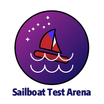
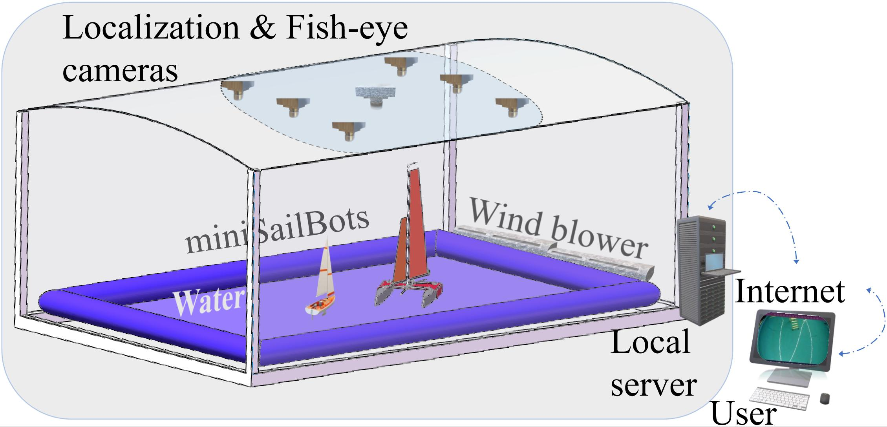
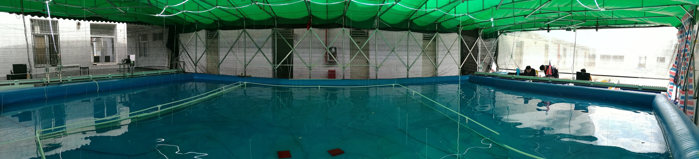
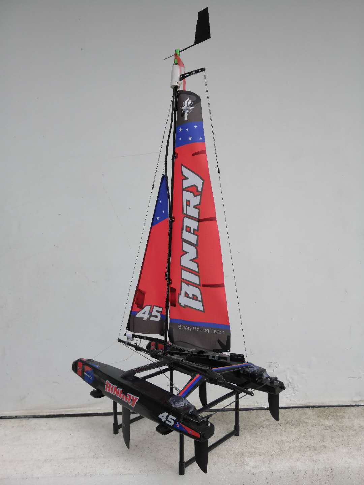
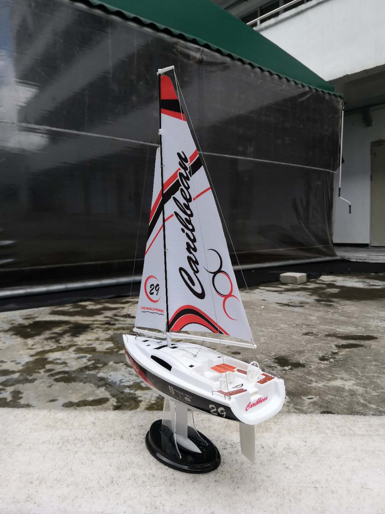
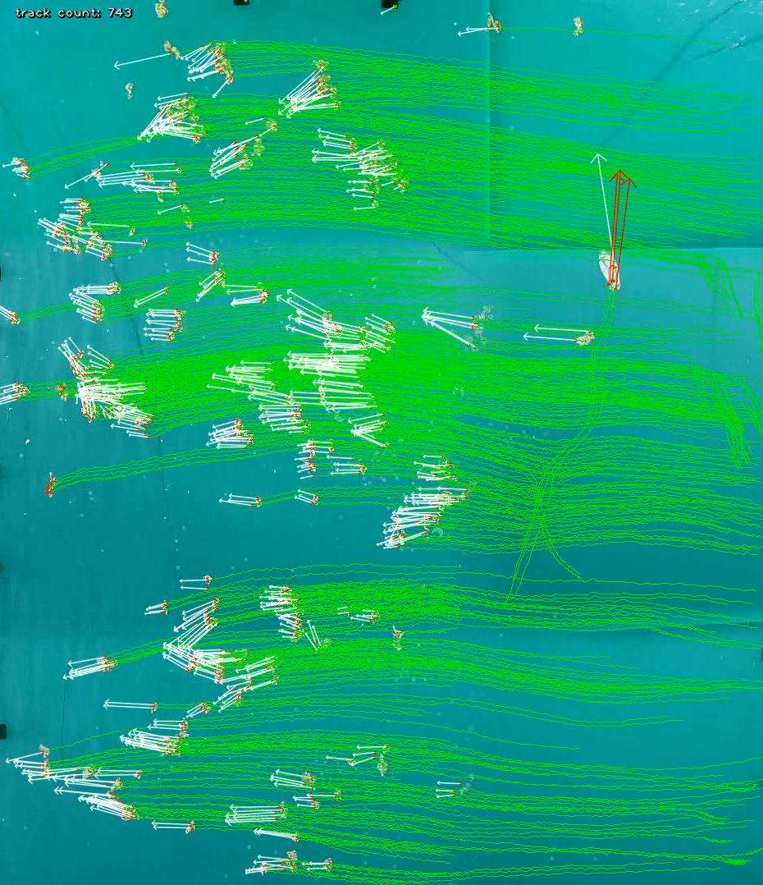
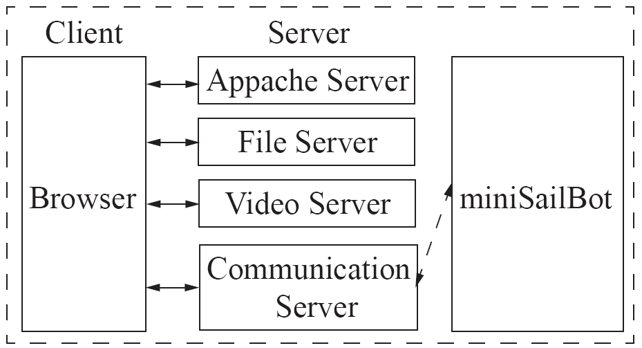
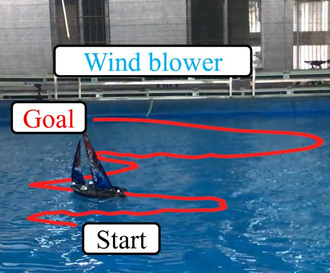
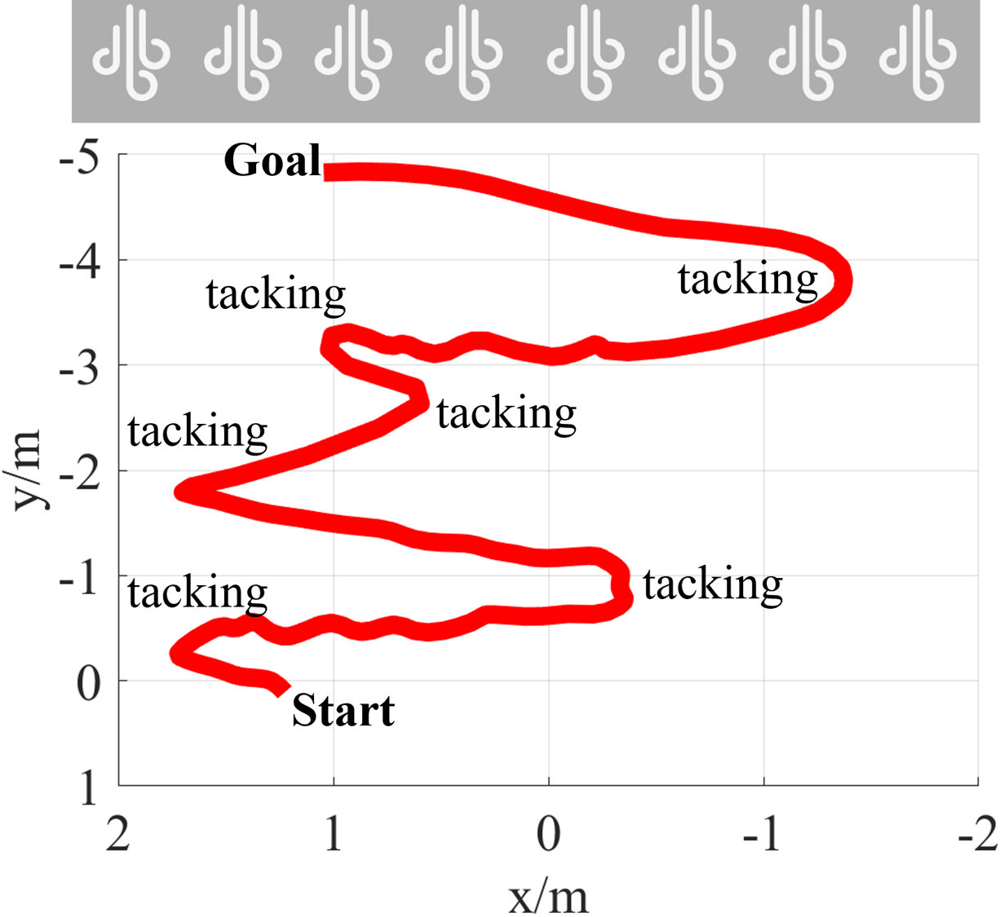
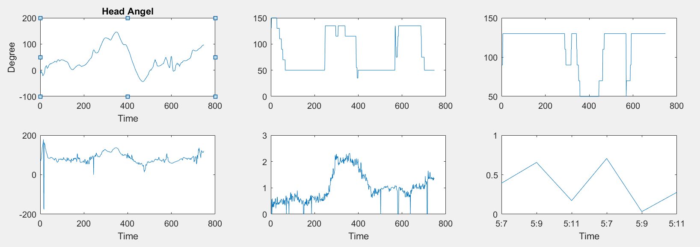

# Sailboat Test Arena ([STAr](http://sailboat.oicp.io/STAr/))

  

Sailboat Test Arena ([STAr](http://sailboat.oicp.io/STAr/)) is a research project related to teleoperation and automation of sailboats, conducted by State Joint Engineering Lab on Robotics and Intelligent Manufacturing, The Chinese University of Hong Kong, Shenzhen. This repository contains its web server, serial server, and some data.

## STAr Architecture

### Overview

  

TODO : say something

### Physical Environment

  

TODO : say something

#### miniSailBots

  
  

TODO : say something

#### Camera

  

TODO : say something

  

#### Wind Field

  

TODO : say something

#### Web Server

  

TODO : say something

### Experiment

  
  

TODO : say something

  

TODO : say something

#### Result

TODO : say something
see [Experiment.mp4](STAr/video/exp.mp4)

## Repo. Catalogue

* [STAr](STAr)                - main workshop directory.
* [develop](develop)          - test & develop directory.
* [docs](docs)                - some reference documents.
* [dataprocess](dataprocess)  - some processed data.
* [README.md](README.md)      - readme file.
* [Sailboat_Nomenclature.jpg](Sailboat_Nomenclature.jpg) - Retrieved from [实用帆船术语中英对照解析之帆船结构](http://chinasailing.com/article/show?id=337)

## License

TODO : say something, this is a public repo.

## Reference

* [International Regulations for Preventing Collisions at Sea](https://en.wikipedia.org/wiki/International_Regulations_for_Preventing_Collisions_at_Sea)
